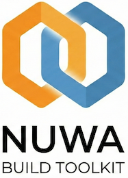

<p align="center">

</p>

# Welcome to Nuwa

Nuwa is the open source toolkit for building Python extensions in Nim. It handles the code (SDK), the compilation (Build), and the distribution (CI/CD) so you don't have to.

## Why Nim?

Nim combines the performance of C with the elegance of Python. It's perfect for building high-performance Python extensions:

- **C-like performance** without the complexity
- **Python-like syntax** that's easy to write and read
- **Zero-cost abstractions** and efficient memory management
- **Easy Python interop** via nimpy

## Projects

### [Nuwa Build](nuwa-build/)

Zero-configuration build system for compiling Nim code into Python extensions.

### [Nuwa SDK](nuwa-sdk/)

Python interoperability utilities for building high-performance extensions.

### [Nuwa Build Action](nuwa-build-action/)

GitHub Action for automated wheel building across platforms.

### [Examples](examples/)

Real-world examples built with Nuwa, including [Featuristic](examples/featuristic/) for feature engineering.

## Quick Start

```bash
# Install
pip install nuwa-build

# Create a new project
nuwa new my_project
cd my_project

# Build and run
nuwa develop
python example.py
```

## Getting Started

Select a project from the navigation menu or visit the [Nuwa Build](nuwa-build/) documentation to get started.
